# 📚 Portfólio — Engenharia de Software | FIAP 2026

## Sobre este repositório
Este repositório contém os exercícios práticos e as modelagens desenvolvidas durante a disciplina de Engenharia de Software. O objetivo é documentar o aprendizado sobre o ciclo de vida de desenvolvimento de software, desde o levantamento de requisitos até a modelagem arquitetural.

## Como executar os exercícios
### Pré-requisitos
- Python 3.10 ou superior instalado.
- Visual Studio Code ou qualquer editor de texto de sua preferência.

### Instalação
1. Clone o repositório para sua máquina local.
2. Certifique-se de que possui as bibliotecas padrão do Python (os exercícios utilizam módulos nativos como `time`, `re` e `dataclasses`).
3. Execute os arquivos `.py` diretamente no terminal.

## Exercícios por Aula

### Aula 03 — Requisitos Funcionais vs. Não-Funcionais

#### 💻 Código
Arquivo: [`aula-03-requisitos/gymtrack_validador.py`](aula-03-requisitos/gymtrack_validador.py)
O código implementa um validador para o app GymTrack, verificando se os inputs de treino atendem aos requisitos de negócio definidos. Foi útil para entender como transformar regras textuais em lógica de programação e como medir performance.

#### 🖥️ Execução
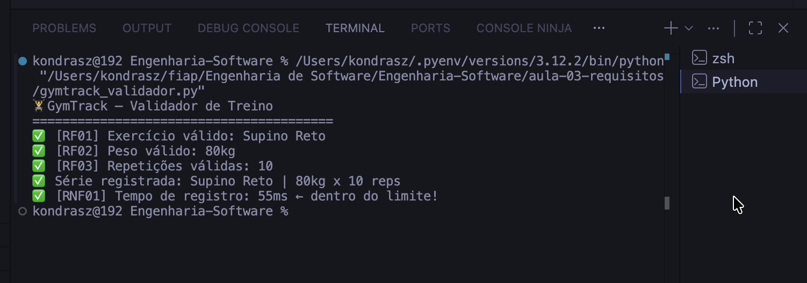
O terminal exibe a validação bem-sucedida de cada requisito funcional (RF) e o cumprimento do tempo de resposta (RNF).

---

### Aula 04 — Documento SRS

#### 💻 Código
Arquivo: [`aula-04-srs/srs_marketplace.py`](aula-04-srs/srs_marketplace.py)
Implementação de uma estrutura de dados para representar um Documento de Especificação de Requisitos de Software (SRS) para um Marketplace. Aprendi a automatizar a validação da qualidade dos requisitos e a exportar a documentação em formato Markdown.

#### 🖥️ Execução
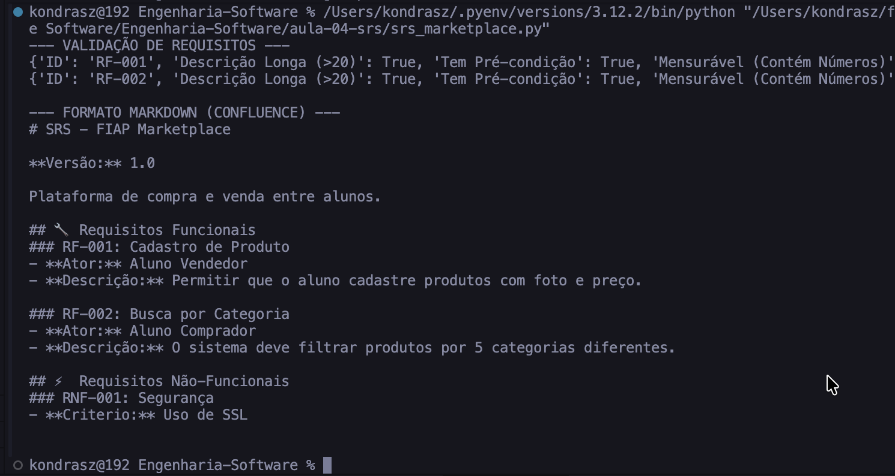
O output mostra a validação dos requisitos cadastrados e a geração automática do documento formatado.

---

### Aula 05 — UML e Casos de Uso

#### 📐 Diagrama
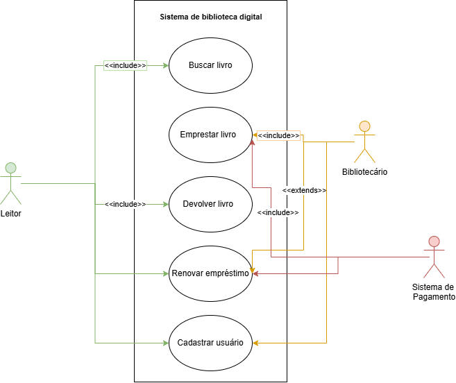
O diagrama representa as funcionalidades de uma biblioteca digital, destacando as relações de `<<include>>` (verificação de disponibilidade) e `<<extend>>` (aplicação de multa por atraso).

#### 💻 Código
Arquivo: [`aula-05-casos-de-uso/biblioteca_digital.py`](aula-05-casos-de-uso/biblioteca_digital.py)
Este código simula o comportamento dos casos de uso modelados, utilizando estruturas de dados para gerenciar o catálogo de livros e os empréstimos ativos.

#### 🖥️ Execução
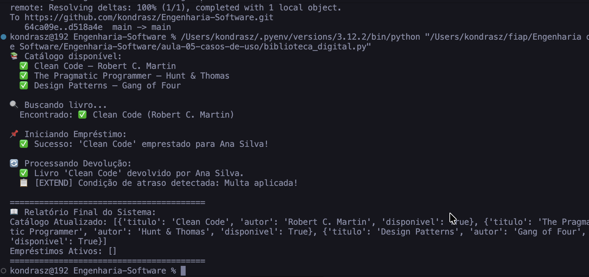
Exibe a simulação completa: listagem, busca, empréstimo e a execução da extensão de multa na devolução.

---

### Aula 06 — Diagramas de Atividades

#### 📐 Diagrama
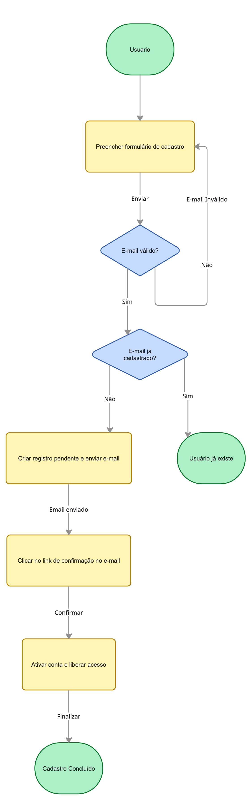
Modelagem do fluxo de cadastro de usuários utilizando raias para separar as ações do usuário e os processos automáticos do sistema, incluindo decisões críticas.

#### 💻 Código
Arquivo: [`aula-06-atividades/cadastro_usuario.py`](aula-06-atividades/cadastro_usuario.py)
O script implementa as decisões do fluxo de atividades, utilizando expressões regulares para validar e-mails e simulando verificações de banco de dados.

#### 🖥️ Execução
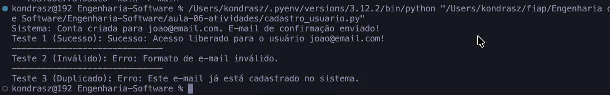
O output demonstra o sistema reagindo a diferentes cenários: sucesso, e-mail inválido e e-mail já existente.

---

### Aula 07 — Diagramas de Sequência

#### 📐 Diagrama
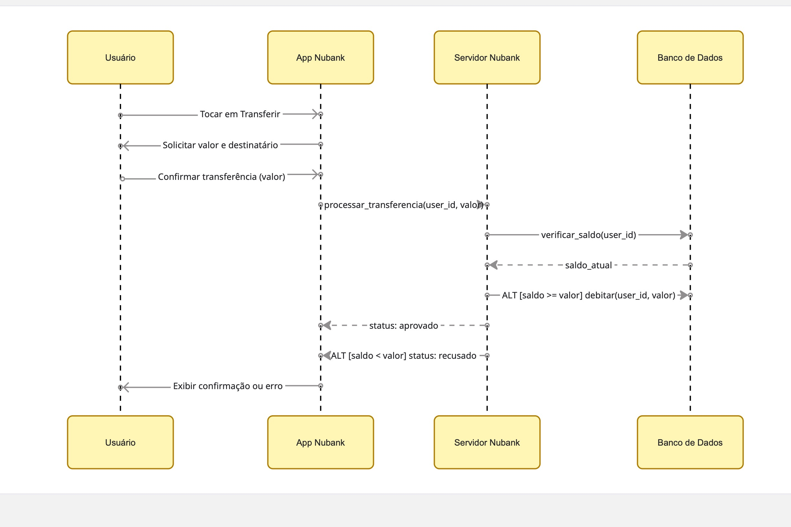
Representa a interação temporal entre o App, o Servidor e o Banco de Dados em uma transferência bancária, detalhando a troca de mensagens e validações.

#### 💻 Código
Arquivo: [`aula-07-sequencia/transferencia_nubank.py`](aula-07-sequencia/transferencia_nubank.py)
Implementação utilizando Programação Orientada a Objetos para representar cada componente do sistema bancário, garantindo o encapsulamento das regras de saldo.

#### 🖥️ Execução
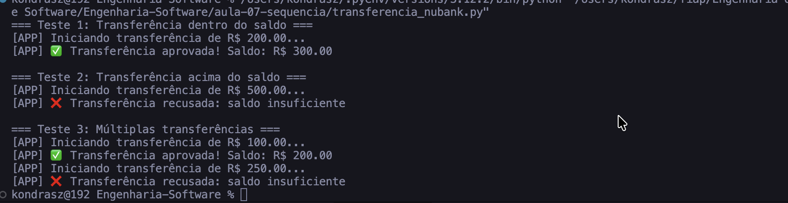
Demonstra o fluxo de aprovação e recusa de transferências baseado no saldo disponível simulado.

---

### Aula 08 — Diagramas de Classes

#### 📐 Diagrama
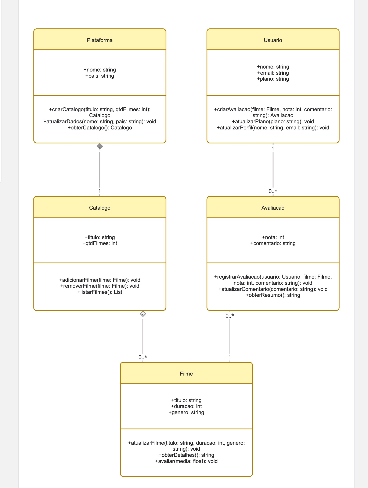
Modelagem de um sistema de streaming focando em tipos de associação. Destaca a Composição entre Plataforma e Catálogo, e a Agregação entre Catálogo e Filmes.

#### 💻 Código
Arquivo: [`aula-08-classes/streaming_netflix.py`](aula-08-classes/streaming_netflix.py)
O código traduz as associações UML em referências de objetos, permitindo que usuários avaliem filmes e catálogos gerenciem obras independentes.

#### 🖥️ Execução
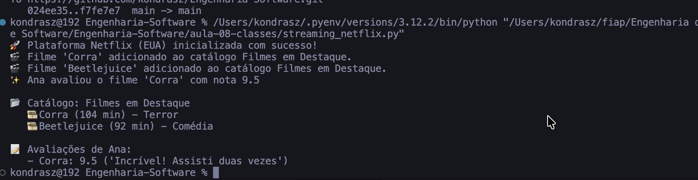
Exibe a inicialização da plataforma, adição de filmes ao catálogo e o registro de avaliações de usuários.

---

### Aula 09 — Arquitetura MVC

#### 💻 Código
O exercício focou na separação de responsabilidades. Através da análise de telas do Figma e diagramas de arquitetura, compreendi como a View (telas) interage com o Controller para manipular o Model (dados).

#### 🖥️ Execução
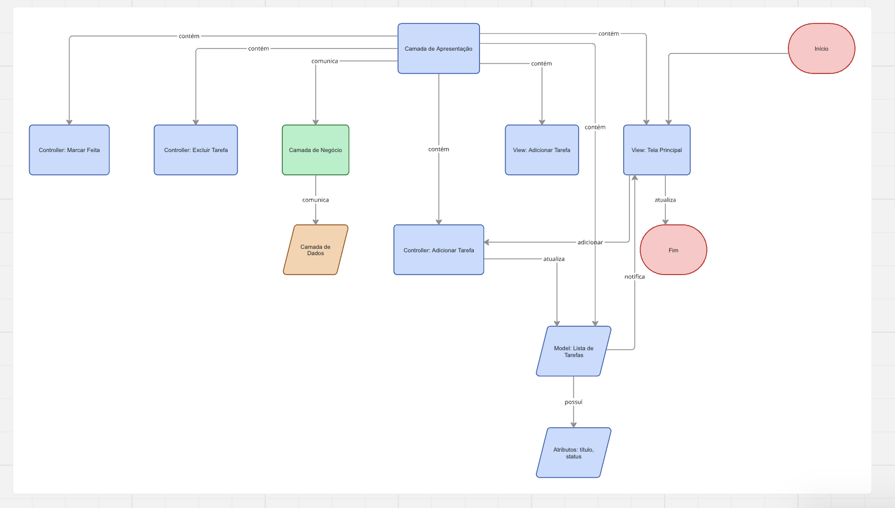
O diagrama detalha a estrutura arquitetural MVC aplicada a um sistema de lista de tarefas (To-Do App).

---

## Links
- [Repositório Principal](https://github.com/kondrasz/Engenharia-Software)
